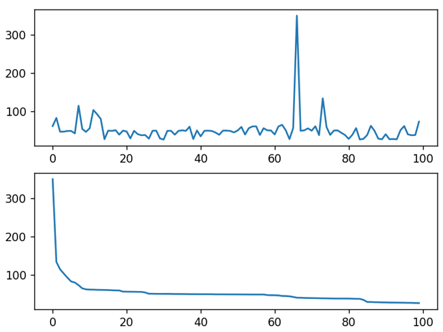
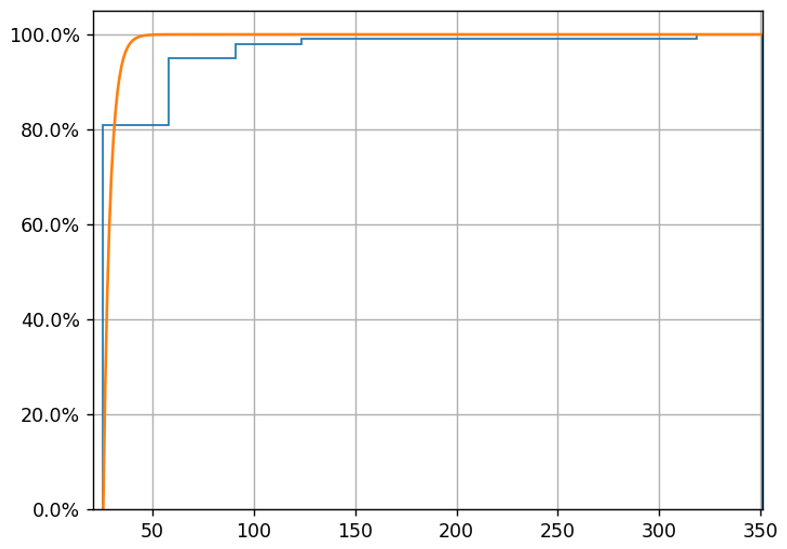
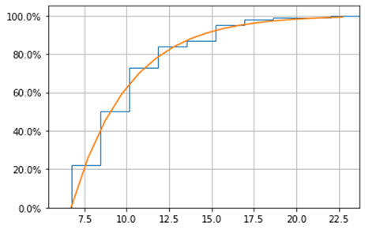
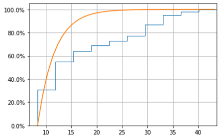

# 数据中心实验报告

**姓名**：陈祺汇			**学号**：M202173480			**班级**：国光硕2104班

## 目录

[toc]

----

## 实验一：系统搭建

1. 下载minio服务器：`minio`

```bash
wget https://dl.min.io/server/minio/release/linux-amd64/minio
```


2. 给minio可执行权限

```bash
chmod +x minio
```

3.  编写minio运行脚本，并运行

```bash
#!/bin/bash
export MINIO_ROOT_USER=cqh
export MINIO_ROOT_PASSWORD=hust_cqh

# Export metrics
export MINIO_PROMETHEUS_AUTH_TYPE="public"

# Use "-C" flag to store configuration file in local directory "./".
# Use server command to start object storage server with "./root" as root directory, in which holds all buckets and objects.
./minio -C ./ server ./root --console-address ":9090"
```


4. 下载minio客户端：`mc`，并赋予其可执行权限

```bash
wget https://dl.min.io/client/mc/release/linux-amd64/mc
chmod +x mc
```


5. 并根据服务器的提示，设置IP、RootUser和RootPass


6. 创建一个名为`myminio/document`的桶，并查看桶

```bash
# 创建桶
./mc mb myminio/document
# 查看桶
./mc ls myminio
```


7. 实现 ①拷贝`1.txt`到桶中；② 移动`2.txt`到桶中；③ 删除桶


8. 安装`S3cmd`

   ```bash
   sudo apt install s3cmd
   ```

9. 配置`S3cmd`使其运行在`minio`上。主要是编辑`~/.s3cfg`文件如下：

   ```bash
   # Setup endpoint
   access_key = cqh
   secret_key = hust_cqh
   host_base = http://192.168.123.125:9000
   host_bucket = http://192.168.125.125/myminio
   use_https = False
   ```

   

10. 配置`aws`

执行如下指令安装`awscli`

```bash
sudo apt install awscli
```

然后完成aws的配置，并查看当前的bucket

```bash
# 直接在bash里输入
aws configure
AWS Access Key ID [None]: cqh
AWS Secret Access Key [None]: hust_cqh
Default region name [None]: us-east-1
Default output format [None]: ENTER
```


## 实验二：性能观测

### Option 1:  S3 Bench

s3- bench的使用方法可参考[官方文档](https://github.com/igneous-systems/s3bench)。

1. 下载安装S3Bench

   ```bash
   go get -u github.com/igneous-systems/s3bench
   ```
   
   > 这个过程中遇到了一个问题：由于网络原因go get无法访问GitHub，从而无法完成下载。其解决方案在[问题1](#问题1. go get无法访问GitHub)中进行了说明。
   
   
   
2. 编写脚本进行测试

   ```bash
   #!/bin/sh
   # locate s3bench
   
   s3bench=~/go/bin/s3bench
   
   if [ -n "$GOPATH" ]; then
       s3bench=$GOPATH/bin/s3bench
   fi
   
   $s3bench \
           -endpoint=http://192.168.123.125:9000 \
           -accessKey=cqh -accessSecret=hust_cqh \
           -bucket=loadgen -objectNamePrefix=loadgen \
           -objectSize=1024 -numClients=2 -numSamples=10240
   ```
   
   

输出格式如下：


可以看到`S3 Bench`对读/写的整体性能以及百分比尾延迟都有较为详尽的展示。

### Option 2：s3-benchmark

原始版本未更新依赖，且兼容性不足，我还尝试了**选项2**，也就是修补后的版本[s3-benchmark](https://github.com/wasabi-tech/s3-benchmark)。

1. 安装`golang-go`

    ```bash
    sudo apt install golang-go
    ```

2. 安装`S3 Benchmark`（选项2）

    ```bash
    # 将镜像地址换为阿里云，以解决GitHub无法访问的问题
    go env -w GO111MODULE=on
    go env -w GOPROXY=https://mirrors.aliyun.com/goproxy/,direct
    
    go get -u github.com/chinglinwen/s3-benchmark
    ```


安装完成后，可执行文件会在`~/go/bin`目录下。


3. 编写脚本文件进行测试

    ```bash
    #!/bin/sh
    
    # Locate s3bench
    
    s3bench=~/go/bin/s3-benchmark
    
    if [ -n "$GOPATH" ]; then
        s3bench=$GOPATH/bin/s3-benchmark
    fi
    
    # Usage of myflag:
    #   -a string
    #         Access key
    #   -b string
    #         Bucket for testing (default "loadgen")
    #   -d int
    #         Duration of each test in seconds (default 60)
    #   -l int
    #         Number of times to repeat test (default 1)
    #   -r string
    #         Region for testing (default "us-east-1")
    #   -s string
    #         Secret key
    #   -t int
    #         Number of threads to run (default 1)
    #   -u string
    #         URL for host with method prefix
    #   -z string
    #        Size of objects in bytes with postfix K, M, and G (default "1M")
    
    $s3bench \
            -a cqh \
            -s hust_cqh \
            -u http://192.168.123.125:9000 \
            -b s3bench-test-cqh \
            -d 60 \
            -t 2 \
            -z 1K
    ```


上述测试的**输入**含义是：

* 创建并测试桶`s3bench-test-cqh`
* 测试时间为`60`秒
* `2`个线程
* 对象的大小是`1K`

上述测试的**输出**的含义是：

* `PUT`测试了60秒，56581个对象，速度为943KB/秒，943个操作/秒（因为object的大小设置为1KB，所以这两个值是一样的），slowdown为0；
* `GET`测试了45秒，113162个对象，速度为2.5MB/秒，2514.8个操作/秒，slowdowns为0；
* `DELETE`测试了20.5秒，平均每秒删除2764.5个对象，slowdown为0。

然而`s3-benchmark`输出了整体的速度，没有尾延迟等更细节的性能展示。

### 问题探究 1：对象尺寸如何影响性能

使用S3Bench分别改变了对象的size为1024、2048、4096、8192，分析其运行结果，指令分别如下。

```bash
./go/bin/s3bench -endpoint=http://192.168.123.125:9000 -accessKey=cqh -accessSecret=hust_cqh -bucket=loadgen -objectNamePrefix=loadgen -objectSize=1024 -numClients=2 -numSamples=102400 > output/s3bench_size1024.txt

./go/bin/s3bench -endpoint=http://192.168.123.125:9000 -accessKey=cqh -accessSecret=hust_cqh -bucket=loadgen -objectNamePrefix=loadgen -objectSize=2048 -numClients=2 -numSamples=102400 > output/s3bench_size2048.txt

./go/bin/s3bench -endpoint=http://192.168.123.125:9000 -accessKey=cqh -accessSecret=hust_cqh -bucket=loadgen -objectNamePrefix=loadgen -objectSize=4096 -numClients=2 -numSamples=102400 > output/s3bench_size4096.txt

./go/bin/s3bench -endpoint=http://192.168.123.125:9000 -accessKey=cqh -accessSecret=hust_cqh -bucket=loadgen -objectNamePrefix=loadgen -objectSize=8192 -numClients=2 -numSamples=102400 > output/s3bench_size8192.txt
```

测试结果如下：

* 写性能

  | Size | Throughput | Max Time | Time-99th %ile |
  | :--: | :--------: | :------: | :------------: |
  | 1024 | 0.83 MB/s  | 0.123 s  |    0.006 s     |
  | 2048 | 1.52 MB/s  | 0.275 s  |    0.009 s     |
  | 4086 | 3.04 MB/s  | 0.460 s  |    0.008 s     |
  | 8192 | 5.95 MB/s  | 0.239 s  |    0.009 s     |

* 读性能

  | Size | Throughput | Max Time | Time-99th %ile |
  | :--: | :--------: | :------: | :------------: |
  | 1024 | 2.16 MB/s  | 0.017 s  |    0.002 s     |
  | 2048 | 4.30 MB/s  | 0.087 s  |    0.002 s     |
  | 4086 | 8.97 MB/s  | 0.086 s  |    0.002 s     |
  | 8192 | 17.64 MB/s | 0.105 s  |    0.002 s     |

通过分析读性能和写性能我们可以得到如下结论：

1. 在我们的测试样例下**读写带宽和对象的大小是正比关系**，也就是说单位时间内输入/输出的对象数目是一定的；
2. 对于写请求，对象大小为4096时的最大执行时间反而高于对象大小是8192时的最大执行时间，这个与直觉不相符；
3. 读请求的99% QoS十分稳定，在[1024, 8192]范围内，随着对象大小的增加，最大执行时间比较稳定。

### 问题探究 2：并发数如何影响写性能

设置对象大小为$128\times 1024B$ 也就是128KB，分别设置并发数为1，2，4，8，16，32，分析系统性能。

* 写性能

  | numClients | Throughput | Max Time | Time-99th %ile |
  | :--------: | :--------: | :------: | :------------: |
  |     1      | 37.62 MB/s  | 0.091 s  |    0.004 s     |
  |     2      | 71.65 MB/s  | 0.338 s  |    0.009 s     |
  |     4      | 141.53 MB/s | 0.104 s  |    0.010 s     |
  |     8      | 234.31 MB/s | 0.131 s  |    0.019 s     |
  |     16      | 334.10 MB/s | 0.128 s  |    0.060 s     |
  |     32      | 356.43 MB/s | 0.140 s  |    0.026 s     |

  

* 读性能

  | numClients | Throughput | Max Time | Time-99th %ile |
  | :--------: | :--------: | :------: | :------------: |
  |     1      | 109.05 MB/s  | 0.004 s  |    0.002 s     |
  |     2      | 272.44 MB/s  | 0.003 s  |    0.002 s     |
  |     4      | 618.85 MB/s  | 0.004 s  |    0.002 s     |
  |     8      | 1231.07 MB/s | 0.004 s  |    0.002 s     |
  |     16      | 870.08 MB/s  | 0.027 s  |    0.007 s     |
  |     32      | 149.79 MB/s  | 0.500 s  |    0.215 s     |


可以得到如下结论：

* 对与写操作，增加线程数可以增加总体吞吐，但是随着线程数的增加，吞吐量趋于稳定。
* 对于读操作，增加线程数：
  * 吞吐量先增加后减小
  * 尾延迟显著提升

## 实验三：尾延迟挑战

### 观测尾延迟

运行`obs-tutorial`的脚本，观察尾延迟。





从图中可以看出，存在个别请求，其延迟远大于平均延迟，这就是尾延迟现象。接下来尝试使用不同的方法来消除尾延迟。


### 对冲请求

简单来说，对冲策略就是：**一次请求会给对端发出多个相同请求，只要有一个成功就认为成功**。延迟发送次要请求，直到第一个请求的未完成时间超过此类请求的95%预期延迟。这种方法将附加负载限制在5%左右，同时大大缩短了尾部延迟。

在应用对冲策略之后得到的延迟曲线如下。



可以看到尾延迟得到了极大降低（横坐标从原本的300多降低到了现在的20多）。

### 关联请求

关联请求，或者叫绑定请求，不是在发送对冲请求之前延迟，而是**在多个服务器上模拟排队请求**，但将它们绑定在一起，但告诉每个服务器还有哪些服务器在其队列中。**当第一个服务器处理请求时，它告诉其他服务器从其队列中取消该请求**。



可以看到，关联请求也极大降低了尾延迟。相比于对冲请求，关联请求的效果稍微差一点，但是其开销很小。

## 实验中遇到的问题及解决方案

### 问题1. go get无法访问GitHub


**解决方案 1**：执行如下指令，将镜像地址换为阿里云，然后再执行上述指令进行下载。

```bash
# 将镜像地址换为阿里云，以解决GitHub无法访问的问题
go env -w GO111MODULE=on
go env -w GOPROXY=https://mirrors.aliyun.com/goproxy/,direct
```

然而在实践过程中发现，这个操作虽然有所帮助（可以多向前推进几步），但是过程中**一些依赖包依然无法下载**。因次尝试了解决方案2。

**解决方案 2**：

1. 安装`gopm`

    ```bash
    go get -u github.com/gpmgo/gopm
    ```

2. 使用`gopm`安装包（用*gopm get -g*代替*go get*）

    ```bash
    gopm get -g github.com/igneous-systems/s3bench
    ```


### 问题2：S3 Bench运行失败

现象：


打开`s3bench`的verbose选项，看到写操作存在如下错误：


重新配置了`aws`，`s3cmd`和`aws-cli`后问题得到了解决。

